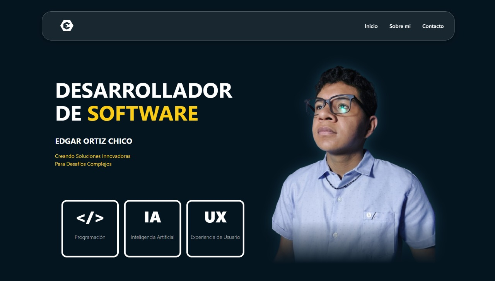
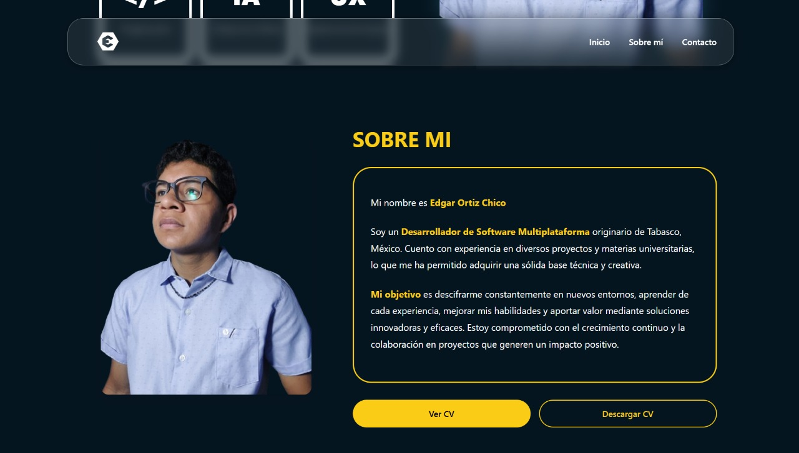
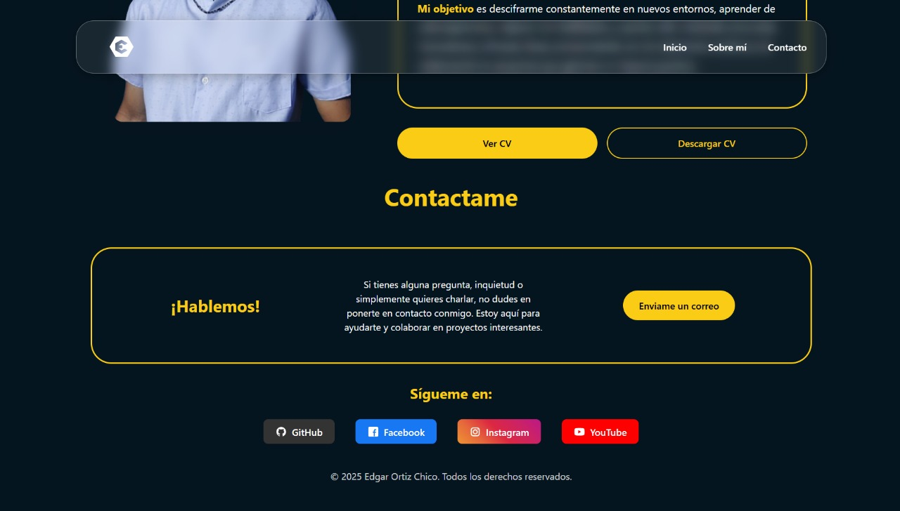
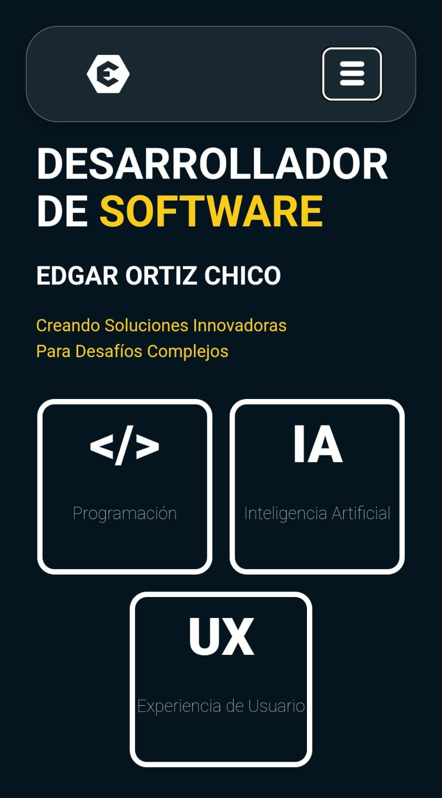

#  Portafolio de Edgar Ortiz Chico

[](https://pages.github.com)
[](LICENSE)

[](https://github.com/EdgarOrtiz98/EdgarOrtiz98.github.io)

<div align="center">
  
  <p><em>✨ Interfaz moderna con diseño oscuro y contrastes amarillos</em></p>
</div>

## 🌟 Demo en vivo
🔗 **[https://edgarortiz98.github.io](https://edgarortiz98.github.io)**

---

## 🚀 Tecnologías principales
<p align="center">
  
</p>

| Categoría       | Tecnologías                                 |
|-----------------|---------------------------------------------|
| **Frontend**    | React, Vite, JavaScript                     |
| **Estilos**     | CSS Modules                                 |
| **Animaciones** | CSS Transitions                             |
| **Hosting**     | GitHub Pages                                |
| **Herramientas**| Figma (Diseño), Git (Control de versiones)  |

---

## ✨ Características destacadas

✅ **Diseño 100% responsive** (Mobile-first)  
✅ **Tema oscuro elegante** con contrastes amarillos  
✅ **Sección de contacto directo** con enlace a email  
✅ **Integración con redes sociales**  
✅ **Despliegue automatizado** en GitHub Pages  
✅ **Galería de proyectos** en desarrollo

---

## 🖼️ Galería de pantallas

<div align="center">
  
  
  
</div>

---

## 🛠️ Configuración local

### Requisitos previos
- Node.js (v18+)
- npm (v9+)

### Instalación
```bash
# Clonar repositorio
git clone https://github.com/EdgarOrtiz98/EdgarOrtiz98.github.io.git
cd EdgarOrtiz98.github.io

# Instalar dependencias
npm install

# Entorno de desarrollo
npm run dev

# Build para producción
npm run build